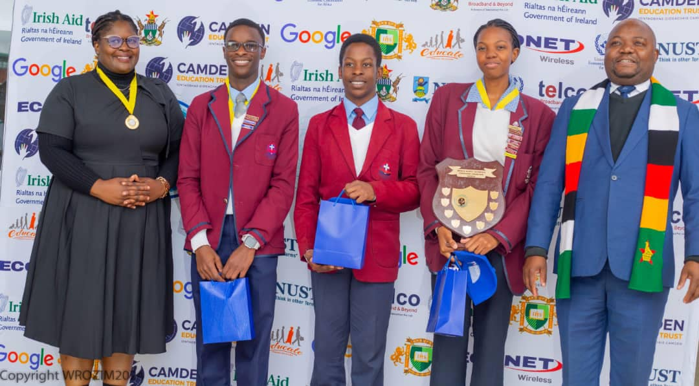
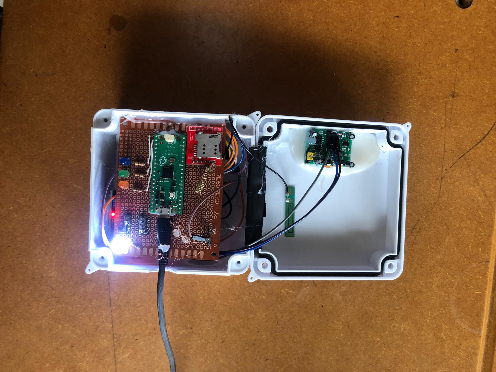
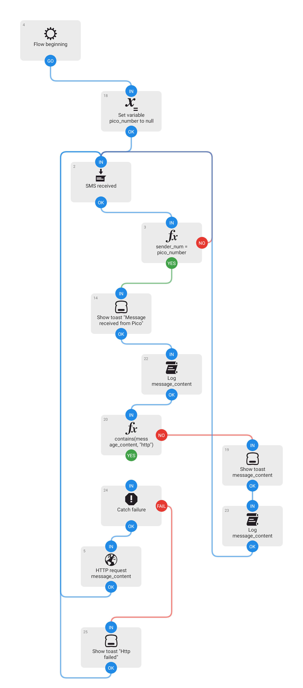

# ForestGuard

A Project For the World Robotic Olympiad National Competition in Zimbabwe.

This project was built around this year's WRO theme: Earth Allies

## Achievement

🏆️ Third Place at the Zimbabwe National World Robotics Olympiad 2024!

## Features ⭐️

- Vehicle Detection using MQ series gas sensors, demonstrated with the MQ2 smoke sensor
- Motion Detection using PIR sensor
- SMS alerts, using the sim800L
- Data logging using the Thingspeak API

## The Project 🤖

This project runs on the Raspberry Pi Pico H.
Comunicating with a server running on my phone using [Automate](https://llamalab.com/automate/),
which then sends data to thingspeak to be displayed.

We had to use Automate because we were not able to get the GSM to communicate with thingspeak via GPRS so instead we used my phone as a server to recieve SMS messages and send http requests.

## Project Report 📄

[Project Report](Project%20Report.pdf)
