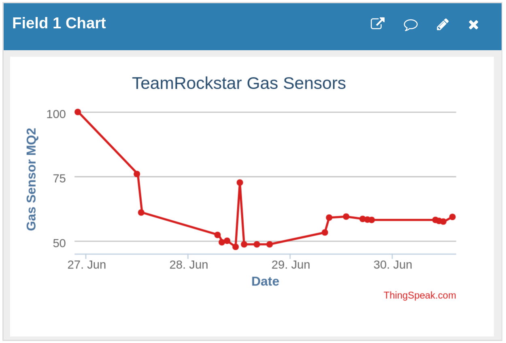

# ForestGuard

A Project for the Zimbabwe National World Robotics Olympiad.
which ran from the 24th to 28th June 2024

## Idea

This project was built around this year's WRO theme: Earth Allies
With the idea of preventing illegal gold panning and deforestation by detecting activity in protected areas.

## 🏆️ Achievement

🥉 Third Place at the Zimbabwe National World Robotics Olympiad 2024!

## ⭐️ Features

- Vehicle Detection using MQ series gas sensors, demonstrated with the MQ2 smoke sensor
- Motion Detection using PIR sensor
- SMS alerts, using the sim800L
- Data logging using the Thingspeak API

## 🤖 The Project

This project runs on the Raspberry Pi Pico H.
Comunicating with a server running on my phone using [Automate](https://llamalab.com/automate/),
which then sends data to thingspeak to be displayed.

We had to use Automate because we were not able to get the GSM to communicate with thingspeak via GPRS
(We kept on getting a private ip address after trying to configure the APN with AT commands, and any GET requests we sent out would return a status code of 603 which seems to mean some sort of DNS error)
So instead we used my phone as a server which is able to receive SMS messages and send the appropriate http requests.

The data was uploaded to thingspeak to be displayed on a graph.

## 📄 Project Report

[Project Report](Project%20Report.pdf)
